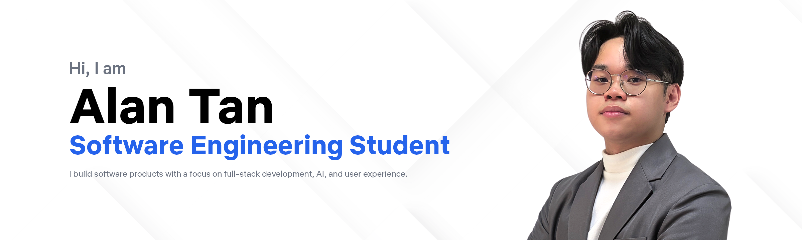

I work across **full-stack development, mobile applications, AI, UI/UX, and games**—bringing engineering and design together to create products that are useful, intuitive, and memorable.

> [!NOTE]
> **📍 Currently** — Completing a Bachelor of Software Engineering at Sultan Idris Education University and building **Planova**, an adaptive study planner that ranks academic tasks and generates personalized schedules.

## 🚀 Featured Projects

### Planova · Adaptive study planner

IN PROGRESS · MOBILE · FINAL-YEAR PROJECT

Turns university tasks, deadlines, and available study time into prioritized tasks and adaptive schedules using machine learning and optimization.

**Contribution:** Full-stack development, product design, scheduling logic, and AI integration  
**Built with:** `Flutter` `Firebase` `Python` `LightGBM` `DEAP`

[Explore Planova on my portfolio →](https://alan-portfolio-navy.vercel.app/)

### CPTyres · Car workshop management system

COMPLETED · WEB · CLIENT PROJECT

Centralizes customers, vehicles, services, job orders, staff, reminders, and analytics for a real automotive workshop client.

**Contribution:** Lead full-stack development, system architecture, interface design, deployment, and client collaboration  
**Built with:** `Laravel` `MySQL` `Tailwind CSS` `VPS`

[Source code](https://github.com/Alantan97/cptyres-system) · [Video demo](https://youtu.be/_BQOTaFezgI)

### TravelBah! · Sabah travel community

COMPLETED · MOBILE · TEAM PROJECT

Brings Sabah destination discovery, travel posts, comments, likes, wishlists, and traveler profiles into one focused mobile experience.

**Contribution:** Team leadership, mobile development, Firebase integration, and interface implementation  
**Built with:** `Flutter` `Dart` `Firebase` `Cloudinary`

[Source code](https://github.com/ncychannnn/TravelBah-) · [Download Android build](https://drive.google.com/drive/folders/1zMQnN6bCvEnQxqyavey7FUrqgdqBXEt6?usp=sharing)

### Memory of Regret · Story-driven 2D platformer

COMPLETED · MOBILE GAME · DIPLOMA PROJECT

Combines exploration, puzzles, quests, collectibles, combat, and boss encounters in an emotional journey about respecting parents.

**Contribution:** Game design and development, gameplay systems, level design, visual production, and narrative implementation  
**Built with:** `Unity` `C#` `Photoshop`

[Game page](https://alantan.itch.io/memory-of-regret) · [Watch trailer](https://youtu.be/HZFHHFQFzdg) · [Download Android build](https://drive.google.com/drive/folders/1V1zlk_0yiKcdmyBtLLLT4Ms1_AhGmALI?usp=sharing)

## 🏆 Selected achievements

### 07 · Worldwide

**Adobe Certified Professional World Championship · Anaheim, California · 2024**

Placed **7th internationally** in an eight-hour design challenge among 47 finalists while representing Malaysia.  
[View Certiport’s official results →](https://www.prweb.com/releases/certiport-names-2024-adobe-certified-professional-world-champion-from-malaysia-302211520.html)

### Malaysia finalist

**Microsoft Office Specialist World Championship · PowerPoint · Orlando, Florida · 2025**

Represented Malaysia at the world championship after placing third in the national qualification.  
[Read the UPSI qualification announcement →](https://epena.com.my/index.php/2025/06/03/pelajar-upsi-raih-tempat-ketiga-dalam-kelayakan-microsoft-office-specialist-world-championship-2025/)

## 🧰 Technical toolkit

**Languages**  
`Python` · `C#` · `C++` · `Dart` · `PHP` · `SQL` · `JavaScript` · `TypeScript` · `Java`

**Web & mobile**  
`React` · `Next.js` · `Flutter` · `Laravel` · `Tailwind CSS`

**Machine learning & data**  
`Scikit-learn` · `LightGBM` · `DEAP` · `Pandas` · `NumPy`

**Platforms & creative tools**  
`MySQL` · `Firebase` · `Git` · `GitHub` · `Figma` · `Photoshop` · `Unity`

## 🎓 Experience & education

**Game Developer Intern** · Noels IT Solution Sdn Bhd  
JUN–JUL 2023  
Built mobile and PC games with Unity and C#, including **Busted!!**, and redesigned the company website.

**Bachelor of Software Engineering** · Sultan Idris Education University  
2023–2027 · CURRENT CGPA 3.84

**Diploma in Game Design and Development** · Sultan Idris Education University  
2021–2023 · CGPA 3.92  
*Memory of Regret* received **Best Project** and **Best Poster**.

---

### 🤝 Have an interesting product or interactive idea?

I’m open to software engineering opportunities and collaborations across web, mobile, AI, and creative technology.

[**View my portfolio**](https://alan-portfolio-navy.vercel.app/) · [**Connect on LinkedIn**](https://www.linkedin.com/in/alantan-dev) · [**Send me an email**](mailto:alant4607@gmail.com) · [**Explore my GitHub**](https://github.com/Alantan97)

